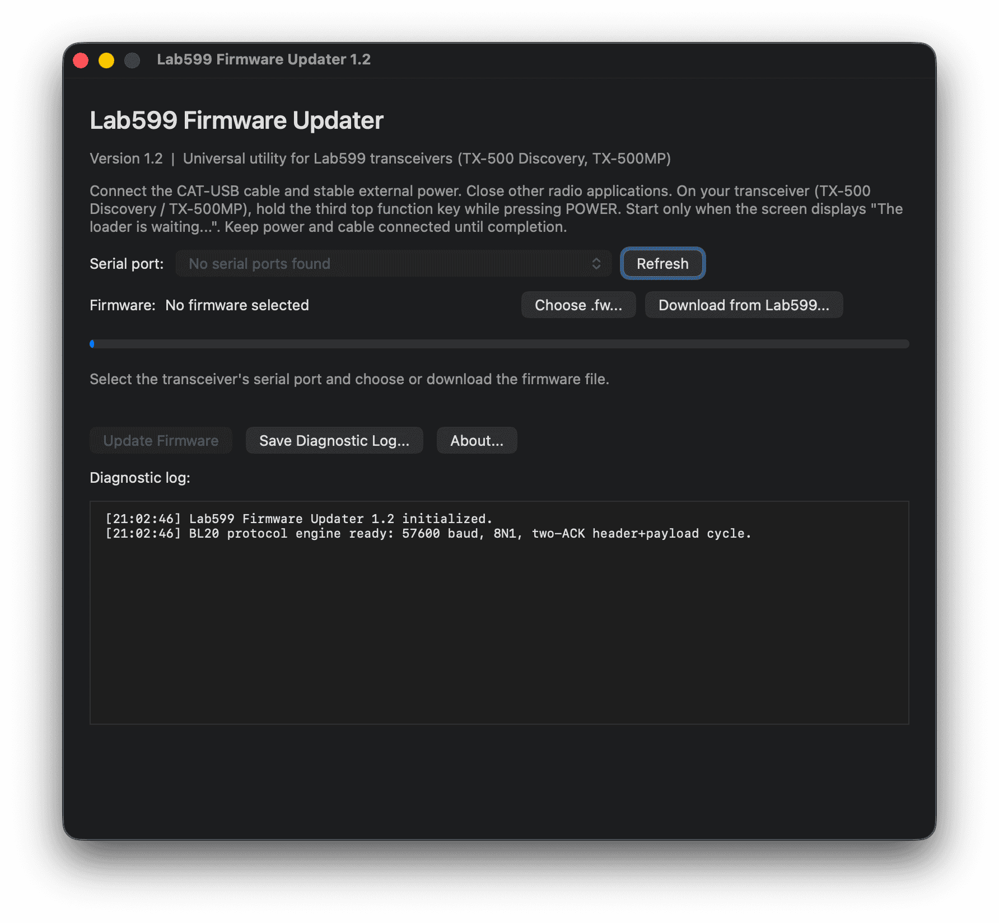
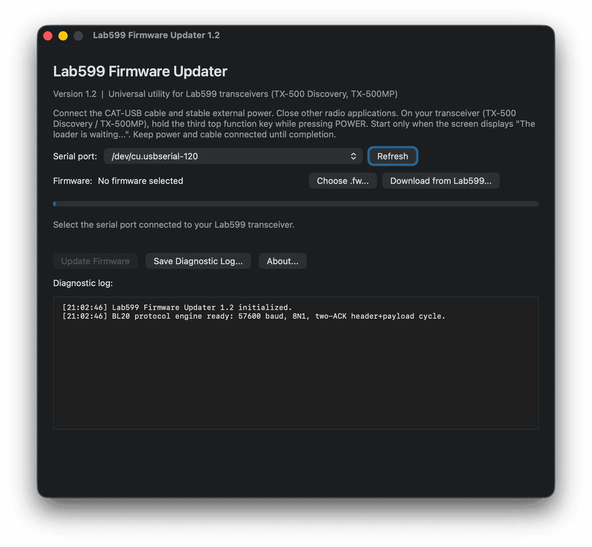
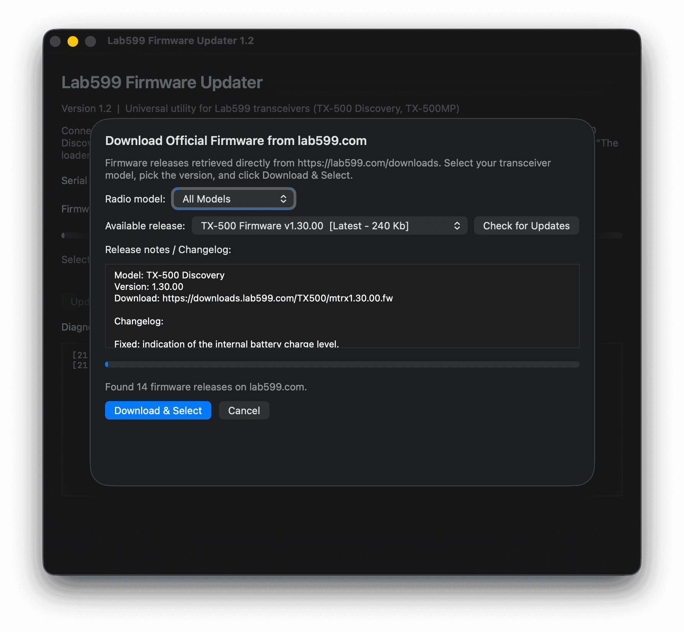

# Lab599 Firmware Updater for macOS

[](https://www.apple.com/macos/)
[-success.svg?style=flat-square)](https://github.com/fact0real/Lab599-Firmware-Updater)
[](https://github.com/fact0real/Lab599-Firmware-Updater)
[](https://www.qrz.com/db/EP2AES)
[](LICENSE)

A native, high-performance macOS utility for updating firmware on **Lab599** transceivers (**TX-500 Discovery** and **TX-500MP**) via CAT-USB serial connection.

Developed by **EP2AES (factoreal)**.

---

## Screenshots

<p align="center">
  
  
</p>

<p align="center">
  
</p>

*Top-Left: Main window showing serial port selector and firmware options.*  
*Top-Right: Auto-detection of CAT-USB serial adapter (`/dev/cu.usbserial-120`).*  
*Bottom: Integrated online catalog sheet fetching official firmware directly from [lab599.com/downloads](https://lab599.com/downloads) with changelogs and model filtering.*

---

## Why This Tool?

Official Lab599 firmware update utilities are distributed only as precompiled binaries for Linux (x86_64) and Windows. macOS users previously had to rely on virtual machines or third-party scripts that frequently failed due to subtle bootloader timing and protocol misunderstandings.

**Lab599 Firmware Updater** solves this by providing:
- A modern, responsive, native Cocoa/macOS interface with dark mode support.
- 100% accurate implementation of the official Lab599 bootloader protocol.
- **Universal compatibility** across the Lab599 transceiver family (**TX-500 Discovery** and **TX-500MP**).
- **Direct online firmware check & download** straight from [lab599.com/downloads](https://lab599.com/downloads).

---

## Key Features

- **🌐 Live Online Firmware Updates**:
  - Automatically queries the official Lab599 download portal (`https://lab599.com/downloads`).
  - Lists official releases and patches for each model (**TX-500 Discovery**, **TX-500MP**).
  - Displays version numbers, file sizes, and full release notes / changelogs.
  - One-click **Download & Select** with real-time download progress.
  - Automatic `BL20` container validation and SHA-256 integrity verification.
  - Built-in offline fallback catalog when no internet connection is available.

- **📁 Local Firmware Support**:
  - Pick any local `.fw` file via the macOS Open Panel.
  - Pre-flight checks guarantee valid file size and header before flashing begins.

- **⚡ Robust Bootloader Engine**:
  - Implements the verified **two-ACK protocol**:
    $$\text{16-byte Header} \longrightarrow \text{Radio "OK"} \longrightarrow \text{Full Payload Stream} \longrightarrow \text{Final Radio "OK"}$$
  - True host output queue drain pacing (`TIOCOUTQ`) matching official Linux/Windows behaviors.
  - Clean error reporting distinguishing header rejection, timeouts, or disconnection.

- **🛡️ Flashing Safeguards**:
  - Requests idle system sleep prevention (`NSProcessInfo`) so the Mac doesn't sleep mid-transfer.
  - Window closure and app termination protections while an update is actively transmitting.
  - Diagnostic logs saved directly to text files for troubleshooting.

- **🍏 Universal macOS Binary**:
  - Native performance on both **Apple Silicon** (M1/M2/M3/M4) and **Intel** Macs.
  - Requires macOS 12 Monterey or later.

---

## Transceiver Update Instructions

### 1. Enter Bootloader Mode
1. Ensure the radio is powered off.
2. Press and hold the **third top function key** (from the left).
3. While continuing to hold this button, press the **POWER** button.
4. The transceiver screen will show:
   > **`The loader is waiting...`**

### 2. Physical Connections
- Connect the 4-pin GX12 to USB CAT cable that came with your radio.
- Provide stable external DC power ($11-14\text{ V}$) to the transceiver. **Do not rely on weak batteries during firmware flashing.**
- Quit any other applications communicating with the radio CAT port (e.g., WSJT-X, flrig, RumLogNG, MacLoggerDX).

### 3. Using the App
1. Launch **`Lab599-Firmware-Updater.app`**.
2. Select your CAT serial port from the dropdown (e.g., `/dev/cu.usbserial-...`). Click **Refresh** if recently plugged in.
3. Select firmware:
   - Click **Download from Lab599...** to choose the latest version directly from the official servers.
   - Or click **Choose .fw...** to select an existing file from disk.
4. Click **Update Firmware**, review the confirmation prompt, and click **Start Update**.
5. Keep your Mac awake and do not disconnect power or cables. The progress bar will track transmission.
6. Once the radio returns its final `OK`, the app will display:
   > **`Firmware transfer complete`**
7. Power cycle the transceiver and verify the new firmware version on startup.

---

## Building from Source

### Prerequisites
- macOS 12 Monterey or newer
- Xcode 14, 15, 16, or 27 (or Command Line Tools with Apple Clang)

### Method 1: Using Xcode
Open `Lab599-Updater.xcodeproj` in Xcode:
```sh
open Lab599-Updater.xcodeproj
```
Select the **Lab599-Firmware-Updater** scheme and press **Product > Build** (`Cmd+B`) or **Run** (`Cmd+R`).

### Method 2: Command-Line (`xcodebuild`)
```sh
DEVELOPER_DIR=/Applications/Xcode.app/Contents/Developer \
xcodebuild -project Lab599-Updater.xcodeproj \
           -scheme Lab599-Firmware-Updater \
           -configuration Release build
```

### Method 3: Standalone Shell Script
A zero-dependency build script is provided:
```sh
./build-updater.sh
```
This compiles a dual-architecture Universal Binary (`arm64` + `x86_64`), installs the high-resolution `AppIcon.icns`, and signs the `.app` bundle ad-hoc.

---

## Technical Details: Bootloader Protocol

Extracted from binary analysis of the manufacturer's Linux 1.0.1 and Windows 1.0.2 utilities:

| Parameter | Specification |
| :--- | :--- |
| **Baud Rate** | `57600` |
| **Framing** | `8N1` (8 data bits, no parity, 1 stop bit) |
| **Flow Control** | None (hardware and software flow control disabled) |
| **Header** | Exact 16 bytes beginning with ASCII `BL20` |
| **Header Acknowledgement** | Radio replies with ASCII `OK` (`0x4F 0x4B`) |
| **Payload** | Full binary stream without individual per-byte acknowledgements |
| **Pacing** | Host output queue drain (`ioctl(..., TIOCOUTQ, ...)`) |
| **Final Acknowledgement** | Radio verifies checksum and writes flash, then replies with final ASCII `OK` |

---

## Author & Attribution

- **Developer:** EP2AES (factoreal)
- **Amateur Radio Callsign:** [EP2AES](https://www.qrz.com/db/EP2AES)
- **Email:** `EP2AES@asis.sh`
- **GitHub Repository:** [https://github.com/fact0real/Lab599-Firmware-Updater](https://github.com/fact0real/Lab599-Firmware-Updater)

---

## License & Disclaimer

This project is an independent open-source contribution for the amateur radio community and is not an official product of Lab599. Lab599, TX-500, and TX-500MP are trademarks of their respective owners.

Distributed under the [MIT License](LICENSE).
